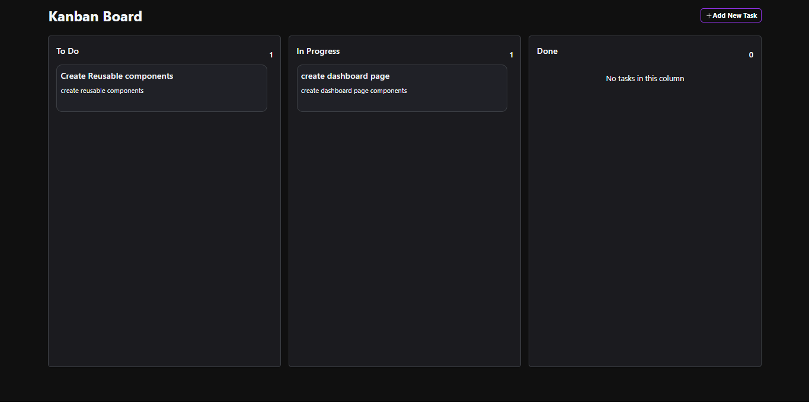

# Task Management Dashboard

## Project Summary

This project is a **Task Management Dashboard** built using **React.js** with **Vite** and **TypeScript**. The dashboard features a Kanban-style board allowing users to:

- **View Tasks**: Tasks are displayed in columns for different statuses: To Do, In Progress, and Done.
- **Create New Tasks**: Users can add tasks to the appropriate columns.
- **Drag and Drop Functionality**: Tasks can be moved between statuses by dragging and dropping.
- **Persistence**: Tasks are stored and managed via API calls to a locally hosted backend using **JSON Server**.

## Instructions to Run the Project Locally

### Prerequisites

Ensure that you have the following installed:

- **Node.js** and **npm** or **yarn**.

### Steps

1. **Clone the repository**:

   ```bash
   git clone <repository_url>
   ```

2. **Navigate to the project directory:**:

   ```bash
   cd kanban-board
   ```

3. **Install dependencies:**

   ```bash
   npm install
   ```

4. **Start the JSON Server for task persistence:**

   ```bash
   npm run server
   ```

   The JSON Server will run on http://localhost:3500

5. **Start the development server:**

   ```bash
   npm run dev
   ```

   Open the application in your browser at http://localhost:5173.

## Project Architecture and Approach

**Frontend:** Built using React.js with TypeScript for type safety and maintainability.

**State Management:** Local component state is used for task management.

**Backend:** JSON Server is used to simulate API calls for persisting tasks.

**Drag and Drop:** Implemented using the react-beautiful-dnd library for smooth interactions.

**Directory Structure:**

```bash
 src/
 components/
   Column.tsx
   KanbanBoard.tsx
   TaskFormModal.tsx
   TaskItem.tsx
 utils/
   api.ts
   axios.ts
 App.tsx
 index.tsx
```

### output:



## Hosted Link

coming soon
